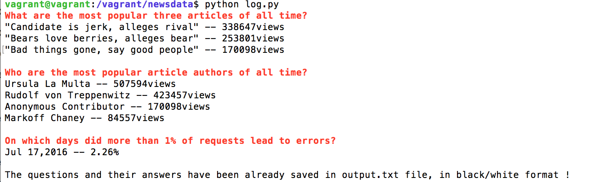

# Logs-Analysis

## Objective: 
It is a Full Stack project that emphsizes python &  SQL skills. 

##Overview:
The tool prints out reports (in plain text) based on the data in the database. It has three questions and the tool answers them by using specific SQL queries. 

## Files:
1. **newsdata.sql**: News database which consists of three tabels:
* The `authors` table includes information about the authors of articles
* The `articles` table includes the articles themselves
* The `log` table includes one entry for each time a user has accessed the site
2. **log.py**: It is a python 3 code that runs the SQL queries by using psycopg2 library
3. **output.txt**: It is a text fiel that contains the output from log.py file

##To Run the tool:
1. Load the database to your local database:
`psql -d news -f newsdata.sql`
2. Run the log.py file:
`python log.py`

##Output:

